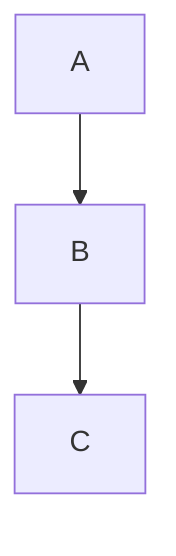

# 生物
## 海牛
## 儒艮


[Features](#features) | [Installation](#installation) | [Usage](#usage) | [Examples](#examples) | [Command-line options](#options) | [網址](#URL)

Table of Contents
=================
   * [gh-md-toc](#gh-md-toc)
   * [Installation](#installation)
 


同步參考SH
```
mod.sh args1 args2
```


- 👋 Hi, I’m @taichimaner
- 👀 I’m interested in ...
- 🌱 I’m currently learning ...
- 💞️ I’m looking to collaborate on ...
- 📫 How to reach me ...

multiple-files
===============


1. aa
2. bb
3. cc
 
 Linux (manual installation)
```bash
$ wget https://raw.githubusercontent.com/ekalinin/github-markdown-toc/master/gh-md-toc
$ chmod a+x gh-md-toc
```

URL
====

- [CSDN](https://www.csdn.net/)

<table>
  <tr><th>aa</th><th>bb</th></tr>
  <tr><td>11</td><td>22</td></tr>
</table>


```html
<script type="module">
import * as d3 from "https://cdn.skypack.dev/d3@7";
const div = d3.selectAll("div");
</script>
```



<!---
taichimaner/taichimaner is a ✨ special ✨ repository because its `README.md` (this file) appears on your GitHub profile.
You can click the Preview link to take a look at your changes.
--->
