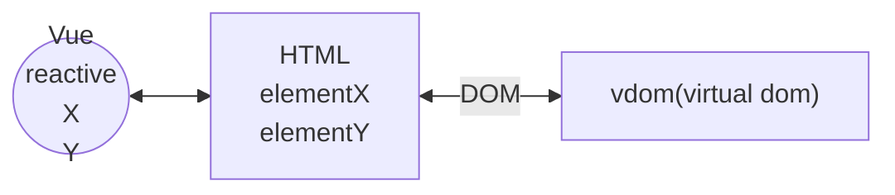
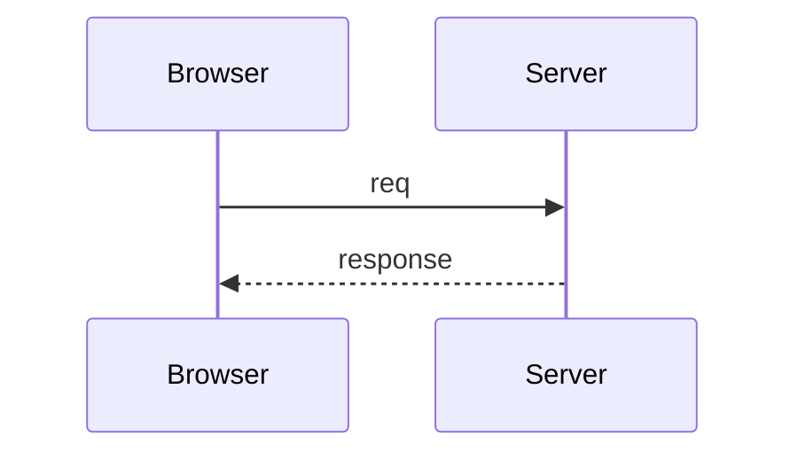
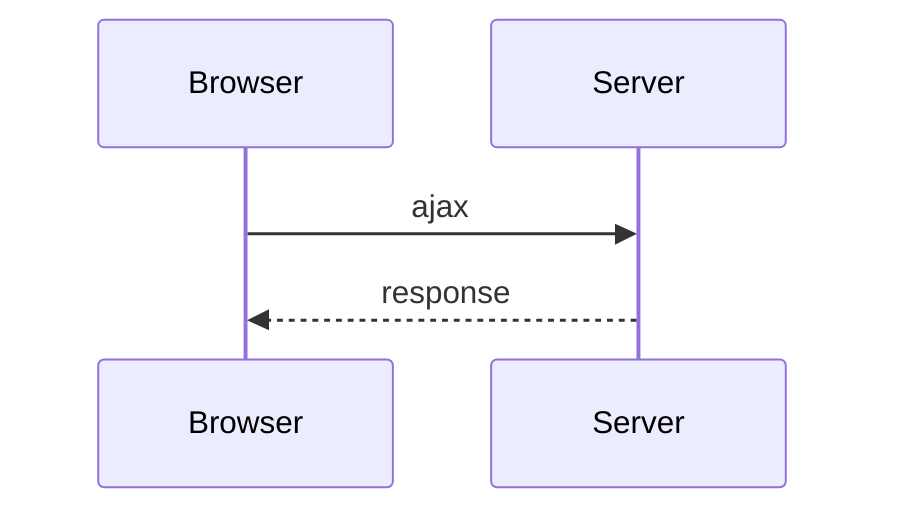

## Reactivity and Render Cycle

```mermaid
graph LR;
Vue((Vue<br>reactive<br>X<br>Y))<-->HTML[HTML<br>elementX<br>elementY];
HTML<--DOM-->vdom["vdom(virtual dom)"];
```

## SPA 

```mermaid
sequenceDiagram
    participant B as Browser
    participant S as Server
    B->>S: req
    S-->>B: response
```
- 之後都是 ajax

```mermaid 
sequenceDiagram
    Browser->>Server: ajax
    Server-->>Browser: response
```

