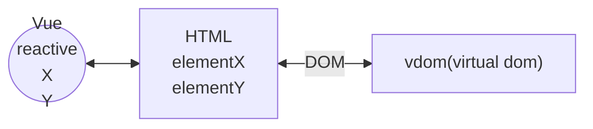
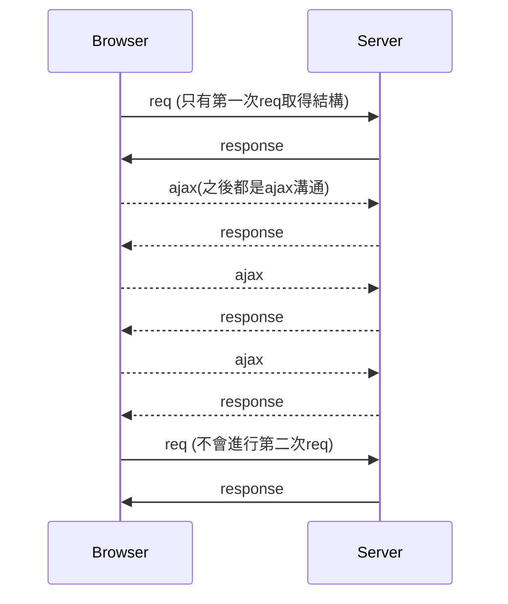

## Reactivity and Render Cycle


```mermaid
graph LR;
Vue((Vue<br>reactive<br>X<br>Y))<-->HTML[HTML<br>elementX<br>elementY];
HTML<--DOM-->vdom["vdom(virtual dom)"];
```

## SPA 
- preventEvent

```mermaid
sequenceDiagram
    participant B as Browser
    participant S as Server
    B->>S: req (只有第一次req取得結構)
    S->>B: response
    B-->>S: ajax(之後都是ajax溝通)
    S-->>B: response
    B-->>S: ajax
    S-->>B: response
    B-->>S: ajax
    S-->>B: response
    B->>S: req (不會進行第二次req)
    S->>B: response
```

- two way binding
- ```v-on``` 可縮寫為 ```@```
- ```v-model``` 可雙向連結


